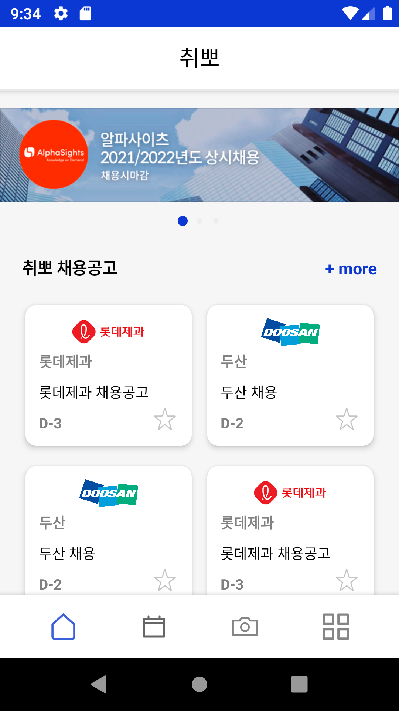
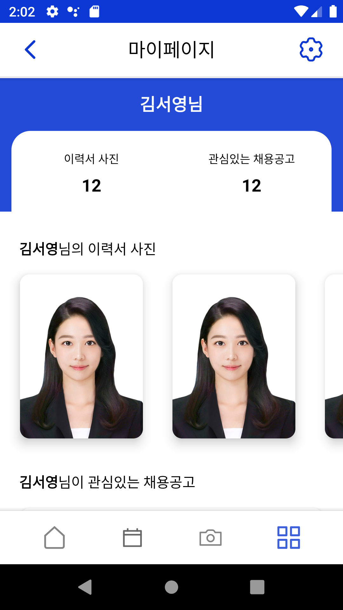
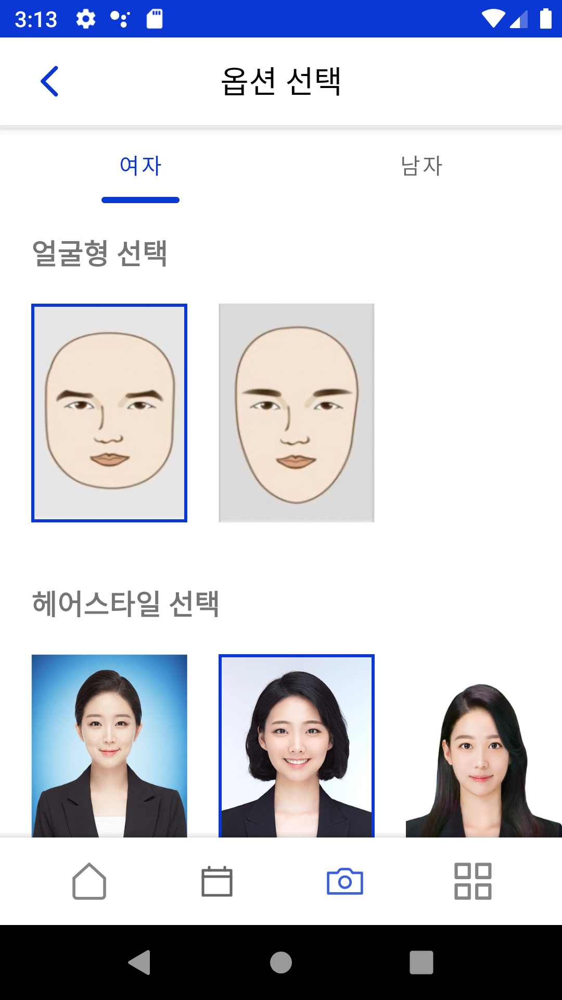
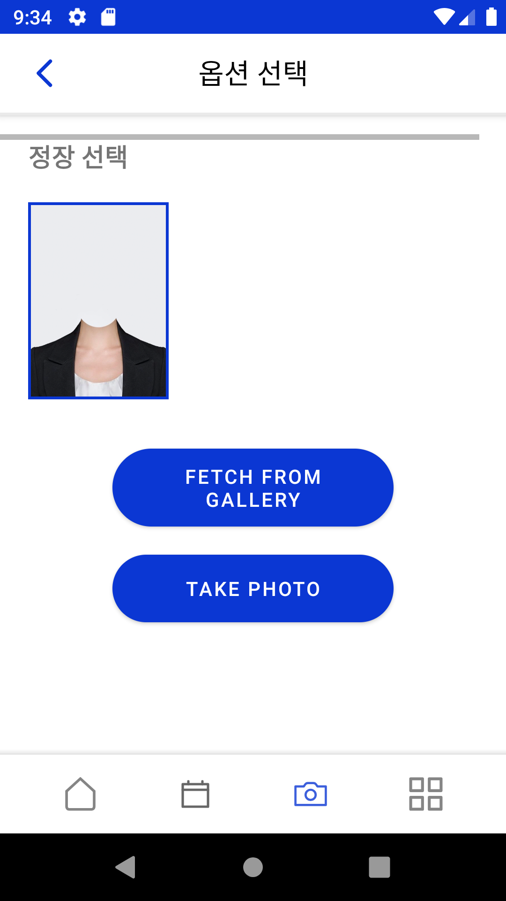
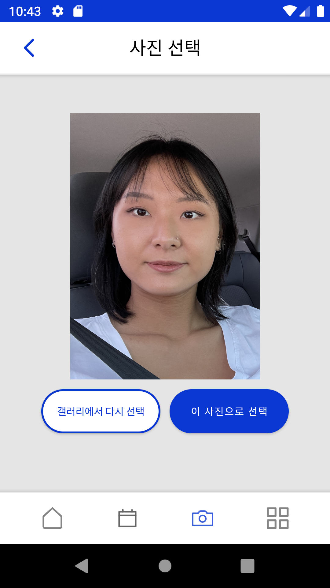
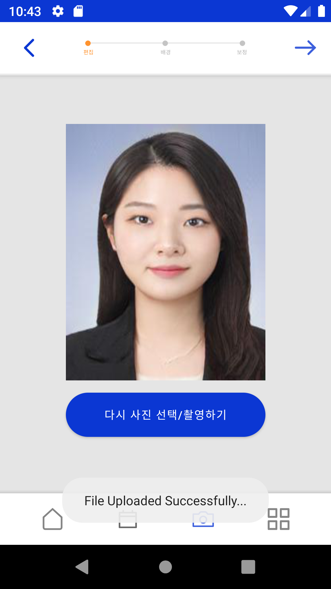
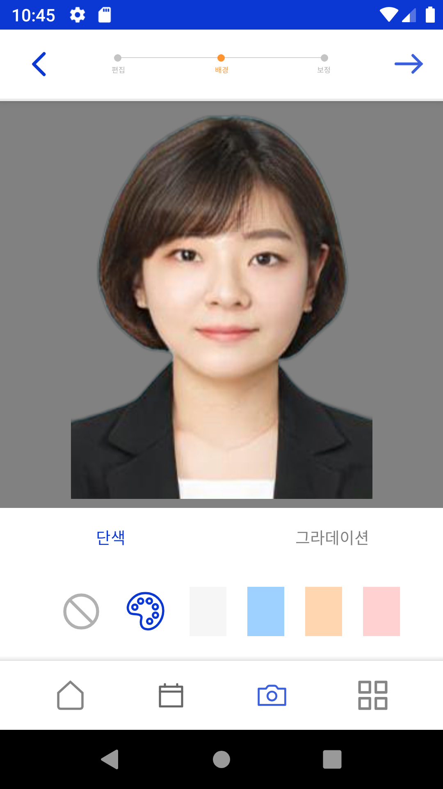
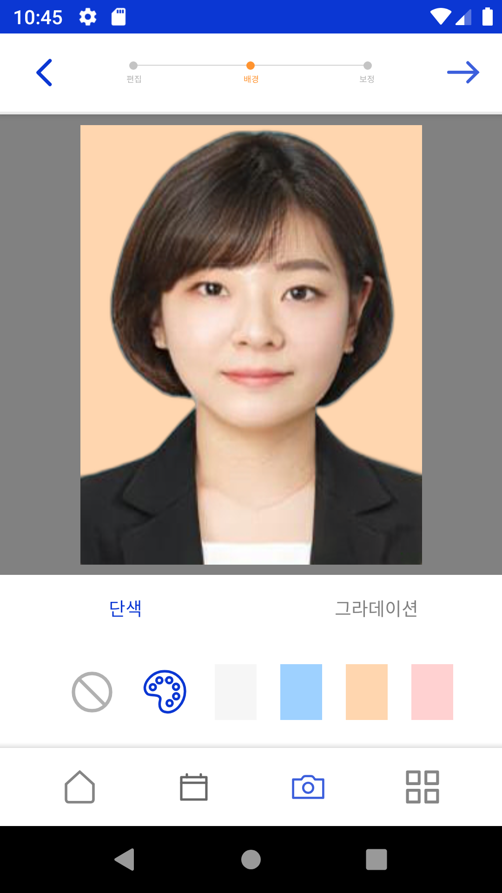
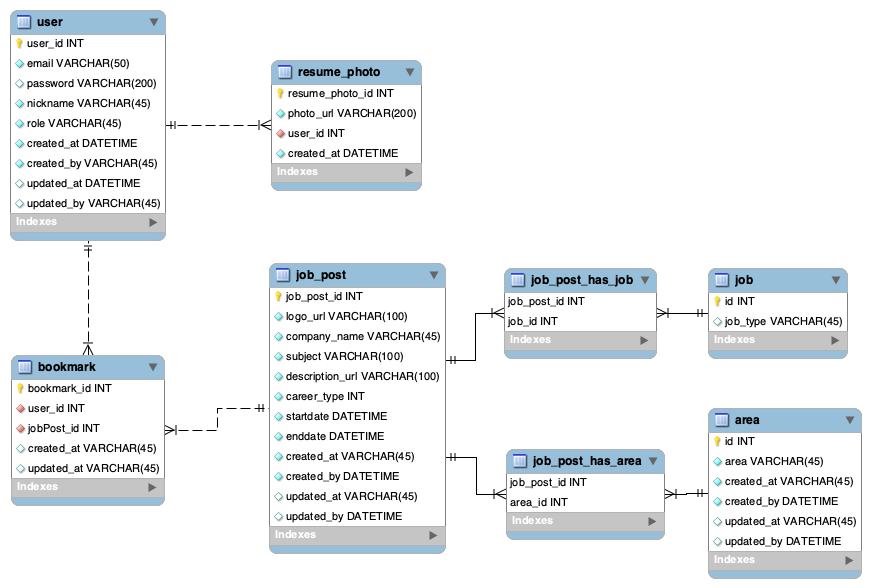
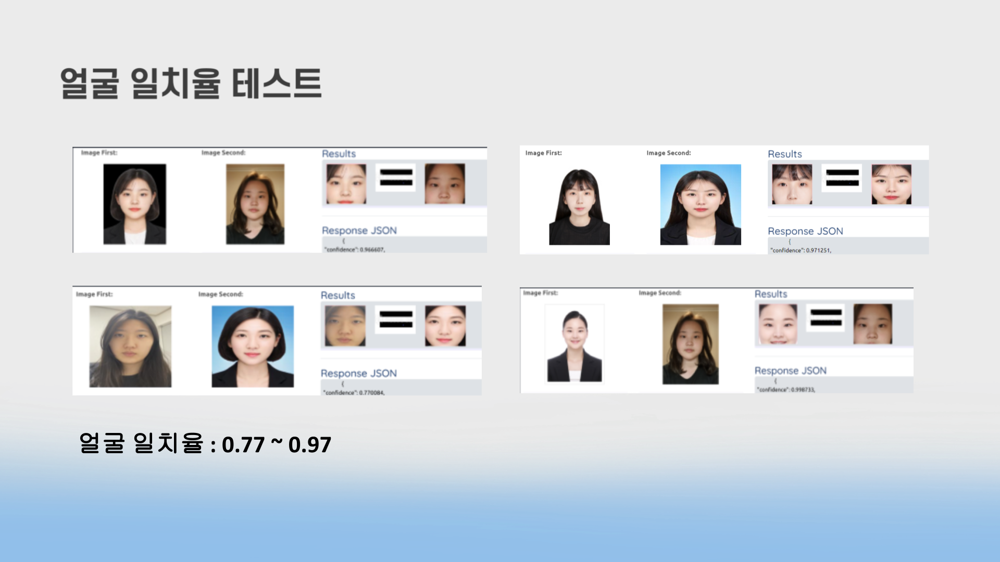

# 취뽀 - GAN 모델 기반 취업 사진 생성 어플리케이션

## 서비스 소개
* 주제 : 비싼 취업 사진은 그만! 언제 어디서나 무료 취업 사진을 찍을 수 있도록 딥러닝 기술을 활영한 취업 사진 생성 어플리케이션
* 핵심 기능 :
    * 취업 사진 느낌의 호감형 분위기 합성
    * 사용자가 선택한 헤어스타일, 정장 그리고 배경을 자연스럽게 합성
    * 얼굴 잡티 제거, 사진 왜곡, 색조 메이크업 등 사용자가 원하는 방향으로 직접 보정 가능
    
* 팀장 : 
   * 강지연 / PM, 회원 인증 및 취업공고 서버개발, 보정 기능 개발, 데이터 수집 및 모델학습 
* 팀원 : 
   * 김서영 / 취업공고 서버 개발, 안드로이드 개발, 데이터 수집 및 모델학습  
   * 김서현 / 안드로이드 개발, 보정 기능 개발, 데이터 수집 및 모델학습 

 

 

 

 

## 서비스 구성도

## ERD

## Spring boot API

## Flask API 1

## Flask API 2

## 모델 test 결과

